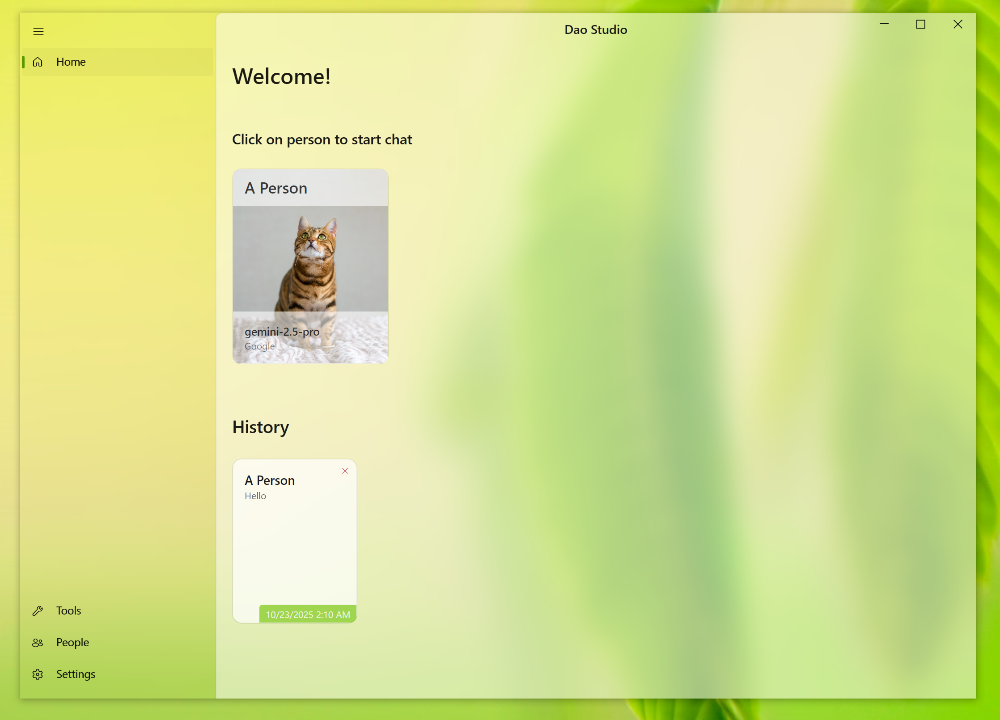
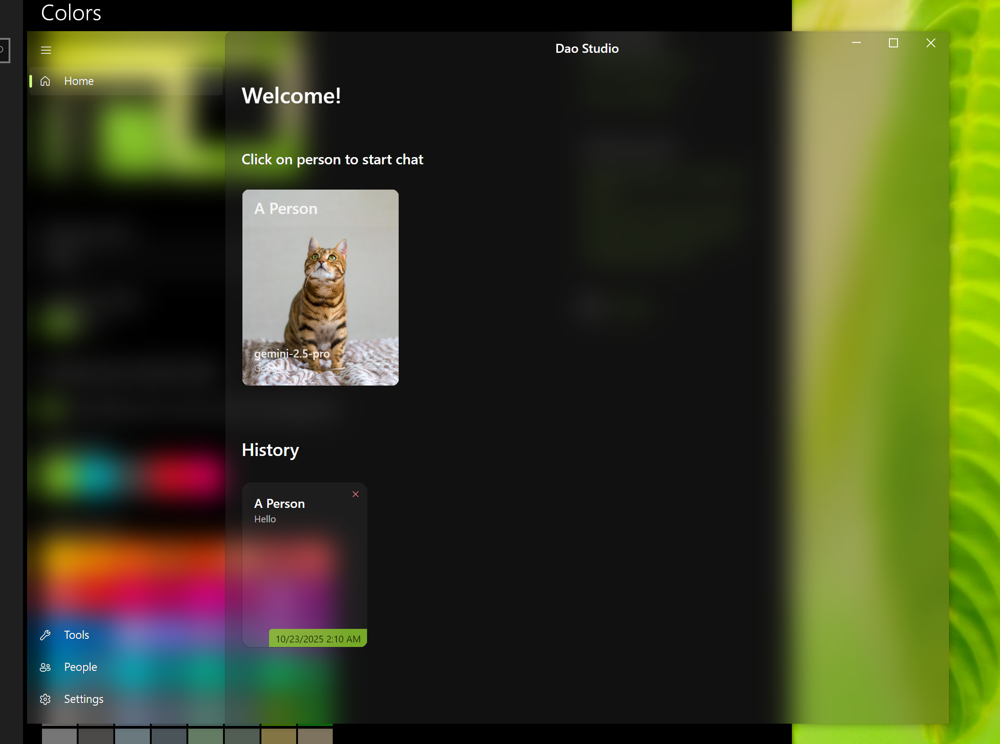

# Dao Studio 🧑‍💻✨

Dao Studio is the originator and runtime of Natural Language Programming (NLP) — a desktop chat client that connects LLMs with real-world software applications.

---

<div align="center">
   <table role="presentation" style="border-collapse: collapse;">
      <tr>
         <td style="padding:4px"></td>
         <td style="padding:4px"></td>
         <td style="padding:4px"></td>
         <td style="padding:4px"></td>
      </tr>
   </table>
</div>

---

## 📚 Table of Contents

 - [💡 Natural Language Programming?](#natural-language-programming)
    - [🧩 Core Concept: Naming](#core-concept-naming)
    - [🎯 Capabilities](#capabilities)
 - [🔍 Use Cases](#use-cases)
 - [⚙️ Features](#features)
 - [🚀 Installation](#installation)
 - [🛠️ Building from Source](#building-from-source)
 - [📝 Contributing](#contributing)
 - [🔒 License](#license)

---

## 💡 Natural Language Programming?

Natural Language Programming in DaoStudio isn't about "English is the new programming language" — it's a structured approach to running natural language scripts on LLMs (which act as processors) using APIs provided by Dao Studio, similar to JavaScript Programming or Python Programming.

NLP aims to solve complex real-world problems in a deterministic and cost-efficient manner.


### 🧩 The Only Core Concept: Naming

The foundation of our NLP is **Naming** — the ability to arbitrarily redefine concepts and act on new definitions. When an LLM misunderstands a concept or lacks domain-specific knowledge, you can "patch" it by providing detailed prompts that refine or redefine the concept.

If you're familiar with philosophy, this is somewhat similar to Wittgenstein's language games or the Chinese concept of 名家 (School of Names).

NLP is simple and intuitive, making it ideal for domain experts who want to automate tasks and solve problems without traditional programming.

#### 🎯 Capabilities

With the Naming tool, you can write scripts to solve any complex problem that humans can solve. Additional parameters like temperature, top-p, and penalties may be configured to fine-tune behavior. 
You can also use lower-cost models for specific concepts or entire scripts, and effectively extend context windows. 

**📝 Note:** Traditional agent benchmarks like browsecomp, are not meaningful measures for Dao Studio, as it can achieve perfect scores on any such benchmark through proper scripting.

For instance, users can leverage the Naming tool to define detailed prompts for specific actions such as clicking, finding text, or inputting data. This enables achieving automation goals with lower-cost models that may actually outperform cutting-edge expensive models, thanks to the precision of human-crafted, context-specific prompts. In most scenarios, AI automation is needed for a limited set of websites or applications. In such cases, Natural Language Programming with cost-effective models provides an deterministic, efficient and economical solution to get the job done.

## 🔍 Use Cases

Natural Language Programming is ideal for:

**🔁 Repetitive tasks for individuals** — Programmers, DevOps engineers, and domain experts who want to automate their work without writing traditional code.

**🧩 One-time tasks with reusable components** — Creating content like social media posts by leveraging components shared by the community.

---


## ⚙️ Features

- 🧠 Natural Language Programming framework
- 💻 Cross-platform support: Windows, macOS, Linux*
- 🖥️ Native desktop UI
- 🔌 Multiple LLM providers: OpenAI, Anthropic, Google, Ollama, and more


\* *🌐 Browser plugins currently have limited functionality on macOS/Linux. We're actively working on full support.*

⚠️ **Early Stage**: Dao Studio and Natural Language Programming are actively evolving. Breaking changes may occur between versions.

---


## 🚀 Installation

1. 📦 Visit the [releases page](https://github.com/DaoStudioAI/DaoStudio/releases)
2. 💾 Download the latest release for your operating system
3. 🗂️ Extract the zip file
4. ▶️ Run `DesktopUI.exe` (Windows) or the equivalent executable for your platform

---


## 🛠️ Building from Source

1. 🌀 **Clone the repository:**
   ```
   git clone https://github.com/DaoStudioAI/DaoStudio.git
   cd DaoStudio/src
   ```

2. 🏗️ **Build the solution:**
   ```
   dotnet build DaoStudio.sln
   ```

3. 🚦 **Run the application:**
   ```
   dotnet run --project DaoStudioUI/DesktopUI.csproj
   ```


---


## 📝 Contributing

Contributions are welcome! 🤝 Please see [CONTRIBUTING.md](CONTRIBUTING.md) for guidelines.


---


## 🔒 License

[GPLv3](LICENSE)

---
